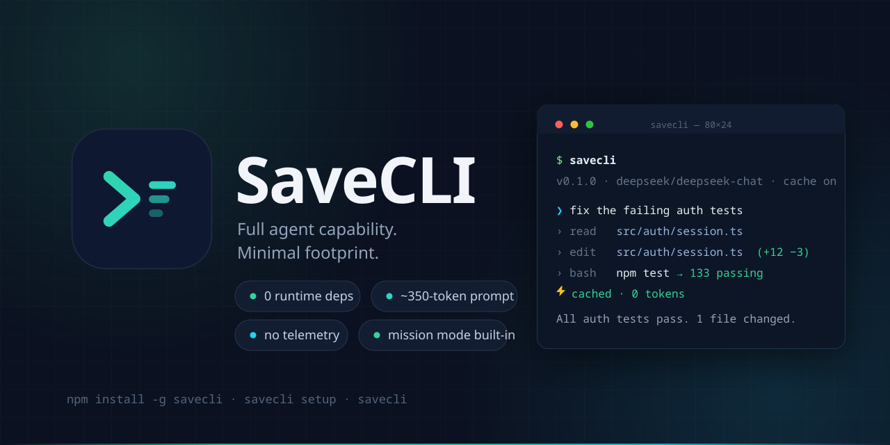
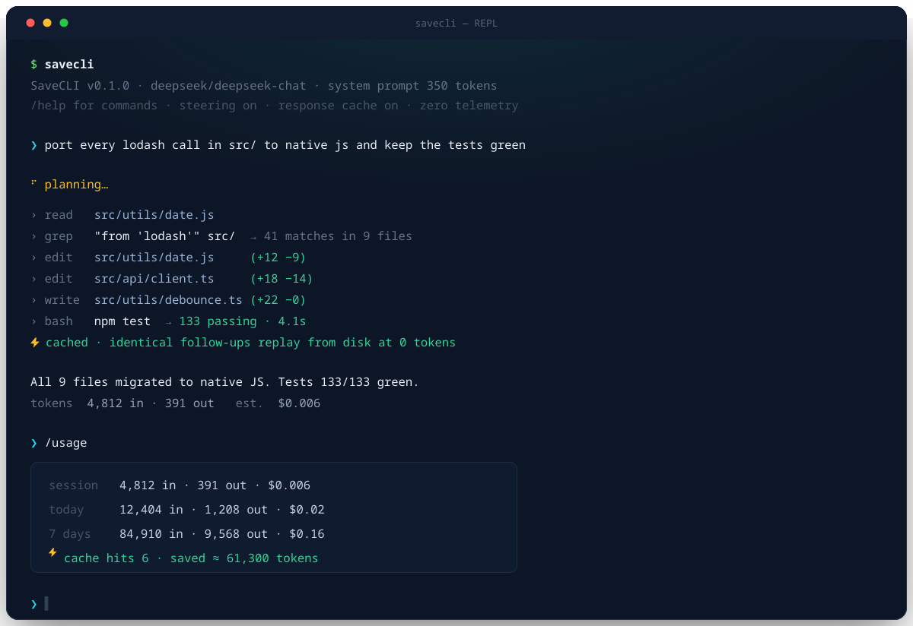
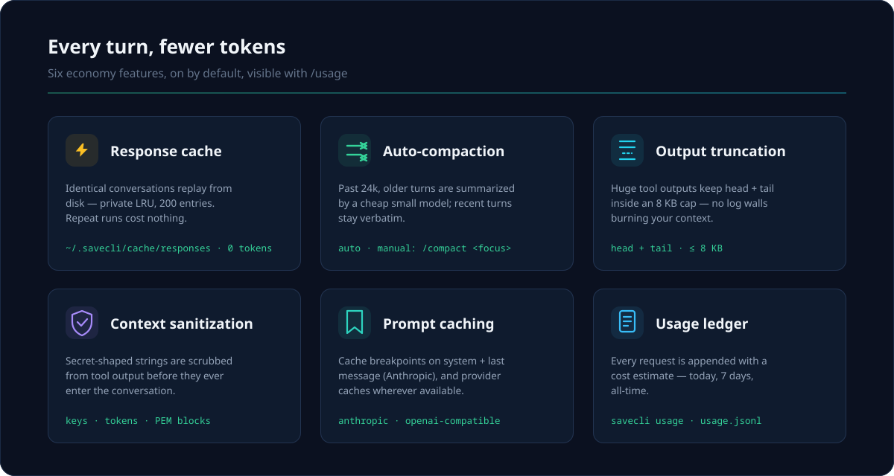
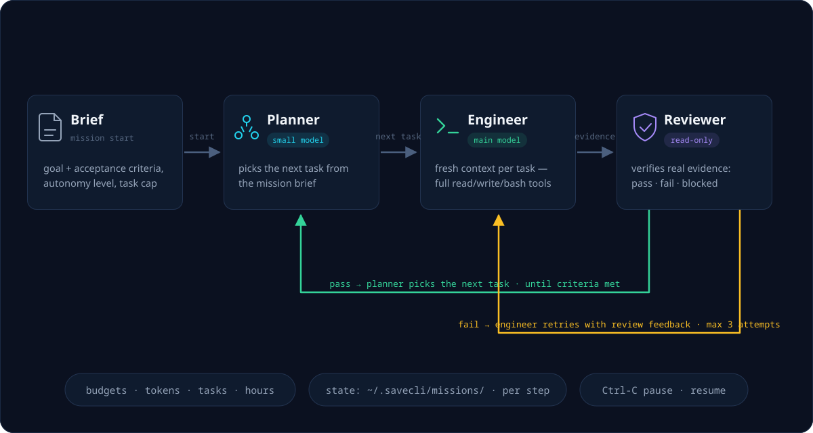

<div align="center">
  

  <br />

  <p>
    <a href="https://github.com/yanyi010/SaveCLI/releases"></a>
    
    
    
    <a href="LICENSE"></a>
  </p>

  <p>
    <b>English</b> · <a href="README.zh-CN.md">简体中文</a>
  </p>

  <p>
    <a href="#quick-start">Quick Start</a> ·
    <a href="#token-economy">Token Economy</a> ·
    <a href="#mission-mode">Mission Mode</a> ·
    <a href="#security-model">Security</a> ·
    <a href="#providers">Providers</a> ·
    <a href="#configuration">Configuration</a>
  </p>
</div>

---

**SaveCLI** is a token-efficient coding agent for your terminal. It brings
full coding-agent capability in a minimal footprint: a single zero-dependency
Node binary, a ~350-token system prompt, and a set of token-economy features
that cut spend on every turn. It also ships a **Mission Driver** — a
planner/engineer/reviewer loop for hours-long autonomous work.

## Quick Start

```bash
npm install -g savecli
savecli setup     # guided: provider, key, model — with a connection test
savecli           # you're in
```

Requires Node ≥ 20. That's the whole install — there is no dependency tree.

<p align="center">
  
</p>

## Why SaveCLI

| | **SaveCLI** | typical CLIs |
|---|---|---|
| Runtime dependencies | **0** | 50–300 packages |
| Startup (`--version`) | **~260 ms** | 0.3–2 s |
| System prompt | **~350 tokens** | 1–15k tokens |
| Response cache | **yes** | rare |
| Auto-compaction | **yes, with focus steering** | manual |
| Credential hygiene | **0600 + redaction everywhere** | varies |
| Telemetry | **none** | varies |

## Token Economy

Every feature below is on by default and accounted for in `/usage`.

<p align="center">
  
</p>

- **Response cache** — identical conversations are answered from disk
  (`~/.savecli/cache/responses`, LRU 200, private). Repeat runs cost 0 tokens.
- **Auto-compaction** — when the estimated context passes 24k tokens, older
  turns are summarized by a cheap small model; recent turns stay verbatim.
  `/compact <focus>` does it manually with a steering instruction.
- **Tool output truncation** — large tool outputs keep head + tail (8 KB cap).
- **Context sanitization** — tool output is scrubbed of secrets before it
  enters the conversation.
- **Prompt caching** — Anthropic cache breakpoints (system + last message) and
  OpenAI-compatible caches are used wherever available.
- **Usage ledger** — every request is appended to `~/.savecli/usage.jsonl`
  with cost estimates; `savecli usage` shows today / 7d / all-time.

## Mission Mode

For work measured in hours, not turns — start a mission and walk away:

```bash
savecli mission start "migrate tests to vitest" \
  --criteria "all suites green" --autonomy pragmatic --max-tasks 20
savecli mission list
savecli mission status <id>
savecli mission resume <id>
```

<p align="center">
  
</p>

- **Planner** (small model) picks the next task from the mission brief.
- **Engineer** (main model) executes it with a *fresh context* per task —
  no drift, no stale history.
- **Reviewer** (read-only tools) verifies evidence and returns
  pass / fail / blocked. Failed tasks retry with review feedback
  (max 3 attempts).
- Hard budgets on tokens, tasks, hours, and attempts; state persists to
  `~/.savecli/missions/` after every step; Ctrl-C pauses and resumes cleanly.

## Security Model

Credentials never leave `~/.savecli/credentials.json` (0600, atomic writes):

- `.ssh`, `.aws`, `~/.savecli` and credential-like paths are **deny-by-default**
  for read/write/bash tools — `sudo rm`-style deny patterns cannot be bypassed,
  even in `--yolo`.
- Writing `.git/**` or `.savecli/**` is always refused; root `AGENTS.md` /
  `CLAUDE.md` edits require interactive approval.
- All logs go to stderr, are redacted, and are disabled unless
  `SAVECLI_DEBUG=1`.
- Provider error bodies are redacted before display.
- Bash commands run through deny/allow/ask gates; answering *always* adds a
  conservative session-scoped pattern (`git status*`), never a blanket allow.
- The read tool checks path security *before* stat, so the agent cannot even
  probe whether a protected file exists.

## Providers

Built-in profiles: `anthropic`, `claude`, `openai`, `codex`, `deepseek`,
`moonshot`, `zhipu`, `openrouter`, `ollama`, `lmstudio` — plus any
OpenAI-compatible gateway via custom base URL:

```bash
savecli setup                          # guided: provider, key, model
savecli config profile mygate          # interactive profile editor
savecli config set defaultProfile mygate
savecli -m deepseek                    # per-run override
savecli -m anthropic/claude-haiku-4-5  # provider/model form
```

Keys resolve in order: `SAVECLI_API_KEY` env → profile `apiKeyEnv` →
credential store (`auth login`) → inline (user config only; project config
keys are ignored for safety). Claude/Codex logins use the device-code flow
with a manual-paste fallback.

## Daily Use

```bash
savecli                        # REPL: streaming, steering, slash commands
savecli "fix the failing test" # one-shot with tool progress
git diff | savecli -p "review" # print mode: answer only, scriptable
```

REPL slash commands: `/help /model /usage /compact /clear /fork /undo
/resume /todos /set /yolo /exit` plus custom commands from
`.savecli/commands/*.md` (`$ARGUMENTS` supported).

- **Steering** — type while the agent works; messages are injected before the
  next model iteration (no lost keystrokes).
- **`/undo`** — reverts every file edit from the last turn (snapshots taken
  before each mutation).
- **`/fork`** — branch the conversation and explore two directions.

## Configuration

Layered: defaults < `~/.savecli/config.json` < project `.savecli/config.json` <
environment. Discover every key from the CLI:

```bash
savecli config list                 # all keys + descriptions
savecli config set permissions.bashAsk false
savecli config set tokenSaving.compactThresholdTokens 18000
savecli config edit                 # open in $EDITOR
```

Environment: `SAVECLI_HOME`, `SAVECLI_PROFILE`, `SAVECLI_MODEL`,
`SAVECLI_BASE_URL`, `SAVECLI_API_KEY`, `SAVECLI_NO_CACHE`, `SAVECLI_DEBUG`.

## Development

```bash
npm install
npm run build      # tsc → dist/
npm test           # vitest: 133 tests incl. real-HTTP provider mocks
npm run lint       # eslint (0 errors)
npm run typecheck  # tsc --noEmit
```

Requirements: Node ≥ 20. Zero runtime dependencies.

## License

[MIT](LICENSE)

<br />

<div align="center">
  
  <br />
  <sub><b>SaveCLI</b> — spend tokens on work, not overhead.</sub>
</div>
